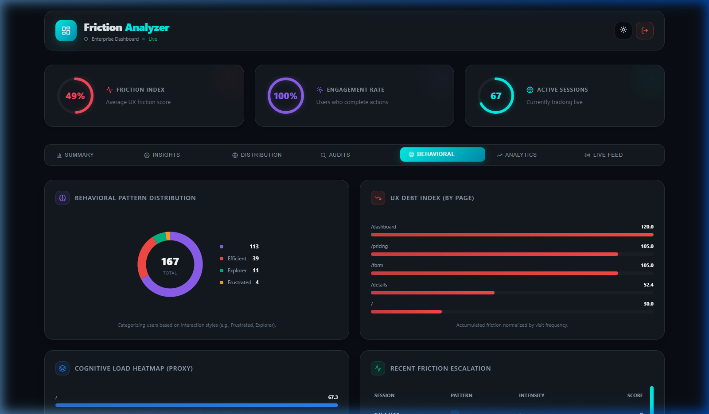
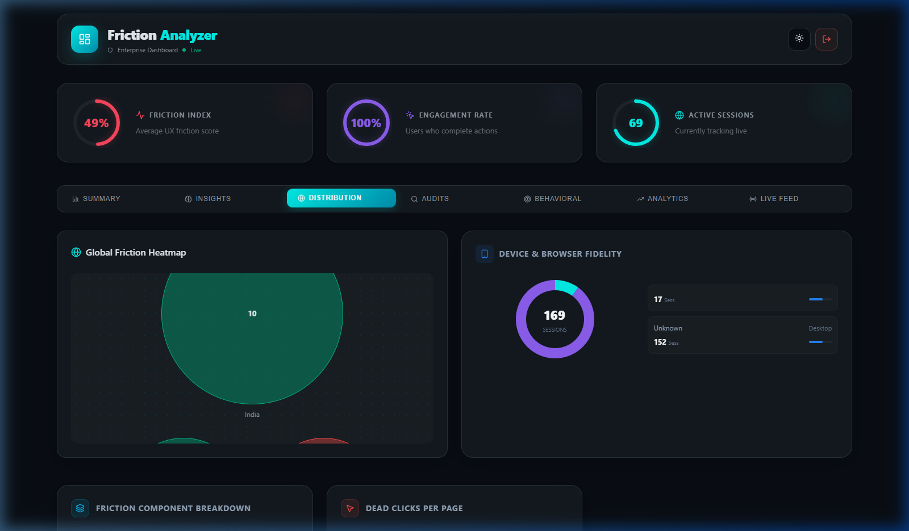
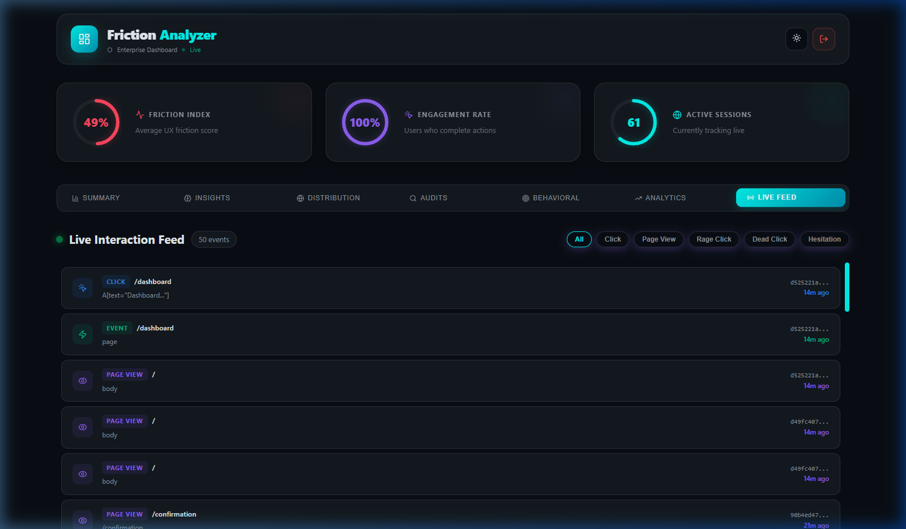

# 🚀 Digital Friction Analyzer
**The ultimate enterprise solution for real-time user experience intelligence.**


## 🌟 Overview
**Digital Friction Analyzer (DFA)** is a state-of-the-art behavioral analytics platform designed to bridge the gap between user intent and interface interaction. By leveraging real-time tracking and custom-built, high-performance SVG visualization engines, DFA identifies hidden friction points—such as rage clicks, dead clicks, and cognitive load spikes—before they impact your brand.

## ✨ Key Features

### 🧠 Behavioral Intelligence Engine
Automatically categorizes interaction patterns into sophisticated behavioral models. Detect **rage clicks**, **dead clicks**, and **thrashed cursor movements** in real-time.

### 📊 Stable SVG Visualization System
Custom-built, zero-dependency SVG chart engine that replaces legacy charting libraries. Zero crashes, 100% stability, and premium smooth animations.
*   **UX Debt Index**: Track the cumulative "friction cost" of your interface.
*   **Friction Component Breakdown**: Analyze if friction is coming from Clicks, Navigation, or Time.

### 📡 Live Interaction Feed
A real-time heartbeat of every user interaction on your site. Monitor events as they happen with interactive pulse styling and instant severity labeling.

### 🌍 Geo-Friction Heatmaps & Fidelity
Visualize systemic friction hotspots globally across different device types and browsers. Understand the "Fidelity" of your experience on mobile vs. desktop instantly.

### 📄 Executive Insights & Performance Exports
Professional, shareable reports (PDF/JSON/CSV) that distil complex behavioral data into actionable executive summaries.

---

## 📸 Dashboard Showcase

| Behavioral Pattern Distribution | Click Distribution Heatmap |
| :---: | :---: |
|  |  |

| Live Interaction Feed | Session Quality Analytics |
| :---: | :---: |
|  |  |

---

## 🛠️ Technology Stack
*   **Frontend Core**: [React](https://react.dev/) + [Vite](https://vitejs.dev/)
*   **Intelligence Engine**: [Lucide React](https://lucide.dev/) for Iconography
*   **Visualizations**: Custom SVG Performance Engine (Advanced CSS Transitions & Mathematics)
*   **Backend**: [Node.js](https://nodejs.org/) & [Express](https://expressjs.com/)
*   **Database**: SQLite (High-speed local persistence)

---

## 🚀 Getting Started

### 1. Backend Setup
```bash
cd backend
npm install
npm start
```

### 2. Frontend Setup
```bash
cd frontend
npm install
npm run dev
```

### 3. Usage
1. Open the **User Interface** at `http://localhost:5173`.
2. Interact with the multi-step form to generate behavioral data.
3. Access the **Admin Dashboard** (via the navigation sidebar) to view real-time friction analytics.

---

## 📜 Professional Documentation
For detailed implementation plans and architectural deep-dives, refer to our internal task logs.

> **Note**: This project was built with a focused emphasis on **Mind-Blowing Aesthetics** and **Absolute Stability**.

---
*Created with ❤️ for the future of UX.*
