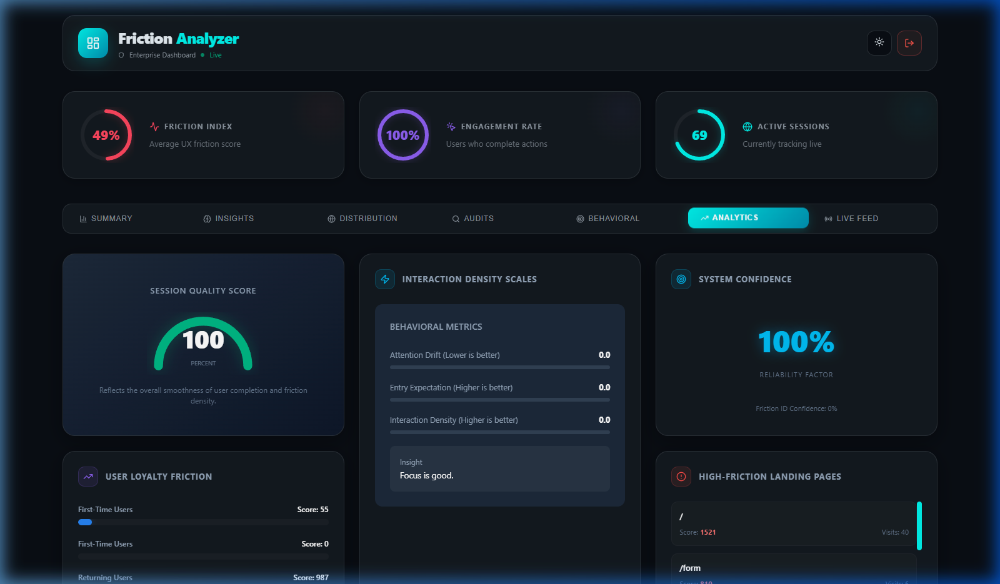

# 🚀 Digital Friction Analyzer (DFA)

**The ultimate enterprise solution for real-time user experience intelligence.**



## 🌟 Project Overview
**Digital Friction Analyzer (DFA)** is a state-of-the-art behavioral analytics platform designed to bridge the gap between user intent and interface interaction. By leveraging real-time tracking and custom-built, high-performance SVG visualization engines, DFA identifies hidden friction points—such as **rage clicks**, **dead clicks**, and **cognitive load spikes**—before they impact your brand.

### 🧬 The Core Mission
To provide developers and UX researchers with a quantitative "Friction Score" that translates messy user behavior into actionable design improvements.

---

## 📈 Key Outcomes & Insights
DFA provides several high-level outcomes to help optimize user journeys:
1.  **Friction Scores**: A numeric score (0-100) representing the level of frustration in a session.
2.  **Behavioral Models**: Automatically classifies users into:
    *   **Explorer**: Normal interacting user.
    *   **Frustrated**: High rage/dead click count.
    *   **Efficient**: Minimum steps to reach success.
    *   **Hesitant**: High time-to-first-click and scroll-wait ratios.
3.  **UX Debt Index**: Identifies pages that consistently cause high friction, allowing teams to prioritize "UI refactoring debt."
4.  **Live Interaction Feed**: A real-time heartbeat of every user interaction with instant severity labeling.
5.  **Heatmaps & Fidelity**: Visual maps of global friction hotspots across different device types.

---

## 📂 File Architecture & Topic Mapping
The project is split into a robust Node.js/Express backend and a responsive React frontend.

### 🔌 Backend (Intelligence Engine)
*   [`backend/server.js`](file:///c:/Users/krish%20vasoya/OneDrive/Desktop/mini%20project/digital-friction-analyzer/backend/server.js): **Main API Entry Point**. Configures Express, manages authentication, session life-cycles, and real-time interaction tracking.
*   [`backend/analyzer.js`](file:///c:/Users/krish%20vasoya/OneDrive/Desktop/mini%20project/digital-friction-analyzer/backend/analyzer.js): **Analysis Core**. Contains the heavy-lifting logic for calculating friction scores and session quality.
*   [`backend/database.js`](file:///c:/Users/krish%20vasoya/OneDrive/Desktop/mini%20project/digital-friction-analyzer/backend/database.js): **Persistence Layer**. Defines the SQLite schema for sessions, logs, scores, and issues.
*   [`backend/seed.js`](file:///c:/Users/krish%20vasoya/OneDrive/Desktop/mini%20project/digital-friction-analyzer/backend/seed.js): **Demo Utility**. Generates realistic behavioral data for testing dashboards.

### 🎨 Frontend (Visualization & Demo)
*   [`frontend/src/App.jsx`](file:///c:/Users/krish%20vasoya/OneDrive/Desktop/mini%20project/digital-friction-analyzer/frontend/src/App.jsx): Main interface controller with routing for Dashboards and Tracking demos.
*   `frontend/src/components/Dashboard`: Contains custom SVG engines for Heatmaps, Friction Funnels, and Live Feeds.

---

## 🧠 Friction Analysis Logic
DFA uses a **Penalty-Based Scoring Algorithm** combined with **Heuristic Rule Sets**:

### 1. Penalty System
Each negative interaction reduces the theoretical "Perfect Score" of 100:
*   **Rage Click**: -10 points (Repetitive clicks on the same element).
*   **Dead Click**: -5 points (Clicking on non-interactive elements like text or labels).
*   **Navigation Loop**: -15 points (User going A -> B -> A, suggesting confusion).
*   **Abandonment**: -30 points (Closing the session after high friction events).

### 2. Behavioral Detection
*   **Micro-Hesitation**: Measures the time between page load and the first interaction. If it exceeds 5s, "Hesitation" is flagged.
*   **Interaction Density**: Ratio of unique targets vs. total clicks. A low density suggests the user is "flailing" on a single element.
*   **Scroll-Correlation**: Matches high scroll depth with low click counts to detect "Content Search Paralysis."

---

## 🛠️ Main Function: `analyzeSession(sessionId)`
The "heart" of the project is the `analyzeSession` function located in [`backend/analyzer.js`](file:///c:/Users/krish%20vasoya/OneDrive/Desktop/mini%20project/digital-friction-analyzer/backend/analyzer.js).

### Function Explanation:
1.  **Data Retrieval**: Fetches all raw `interaction_logs` associated with the `sessionId` from SQLite.
2.  **Sequential Processing**: Iterates through every log entry chronologically to build a stateful model of the user journey.
3.  **Rule Execution**: Applies the `ANALYSIS_RULES` (penalties, thresholds, loops) to calculate:
    *   `clickScore` (Interaction frustration)
    *   `timeScore` (Hesitation metrics)
    *   `navScore` (Flow efficiency)
4.  **Issue Generation**: If thresholds are met, it pushes "Issue Objects" (e.g., `{severity: 'High', description: 'Rage click detected'}`) to the database.
5.  **Result Persistence**: Updates the `sessions` table with finalized friction scores and behavioral patterns, making the data ready for the dashboard.

---

## 🚀 Getting Started

### 1. Backend Setup
```bash
cd backend
npm install
npm start
```

### 2. Frontend Setup
```bash
cd frontend
npm install
npm run dev
```

### 3. Usage
1. Open the UI at `http://localhost:5173`.
2. Interact with the demo forms to generate friction data.
3. Access the **Admin Dashboard** to view the analyzed results in real-time.

---
*Created with ❤️ for the future of UX.*
